<p align="center"><sub>GAME CONTENT CORRECTNESS COMPILER</sub></p>

<h1 align="center">GameForge</h1>

<p align="center"><strong>让游戏内容可以被证明。</strong></p>

<p align="center">
  从策划意图与配置表生成可版本化的 Spec-IR，<br/>
  用确定性检查器、经济仿真和真实 Playtest 找出问题，再经独立审批把验证过的版本写入正式内容。
</p>

<p align="center">
  <code>Graph</code> · <code>Clingo</code> · <code>z3</code> · <code>Economy Simulation</code> · <code>Bounded Agents</code> · <code>Human Approval</code>
</p>

<br/>

<p align="center">
  <a href="https://github.com/MicroYui/game-forge/raw/refs/heads/master/docs/assets/readme/gameforge-complete-workflow-zh.mp4">
    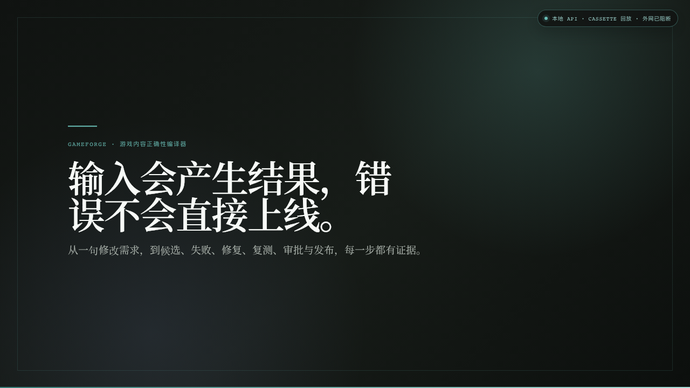
  </a>
</p>

<p align="center">
  <a href="https://github.com/MicroYui/game-forge/raw/refs/heads/master/docs/assets/readme/gameforge-complete-workflow-zh.mp4"><strong>▶ 下载 / 播放完整中文无配音演示</strong></a><br/>
  <sub>约 88 秒 · 输入需求 → 查看差异 → 真实试玩 → 修复复测 → 独立审批 → 应用</sub>
</p>

## 先看一个具体任务

假设你正在维护任务「失踪的商队」。玩家现在需要收集 **3 枚破损徽记**，地图上的唯一采集点也刚好提供 **3 枚**。你想尝试把任务需求提高到 4，于是在 GameForge 的「内容生成」页输入：

```text
Raise the caravan emblem requirement from three to four.
```

也就是：**“把商队任务需要的徽记从 3 枚提高到 4 枚。”**

| 阶段 | 任务需求 | 地图供给 | 正式内容发生了什么 |
|---|---:|---:|---|
| 修改前 | 3 | 3 | 当前版本可完成 |
| 用户输入 | 请求 3 → 4 | 3 | 还没有改变 |
| Agent 候选 | 4 | 3 | 仍未改变，只生成候选 |
| 真实 Playtest | 4 | 3 | 任务未完成，发布被阻止 |
| 修复候选 | 恢复为 3 | 3 | 仍未改变，等待重新验证 |
| 复测与独立审批后 | 3 | 3 | 安全 revision 写入正式内容 ref |

这不是一个“无论输入什么都给成功”的演示。它展示的是：**一次孤立的 3 → 4 改动破坏了可完成性，GameForge 找到失败、阻止发布，并安全撤销了这项改动。** 如果业务仍然要求 4，就应同时把可获得徽记提高到至少 4，再重新走 Review、Playtest 与审批。

## 演示中的完整操作流程

下面逐步拆解的是仓库内预置案例。只想理解产品时，直接看视频和截图即可；要在本地复现，先执行文末的浏览器回放命令，它会准备临时 workspace、示例数据与 maker / approver 两个身份。

第一次看只需记住这些界面词：

- **Base Spec**：修改所依据的内容快照。
- **Constraint snapshot**：本次修改必须遵守的规则快照。
- **Profile**：已经登记的执行配方，例如用哪些检查器或环境。
- **Candidate**：尚未进入正式内容的候选。
- **Patch / preview / config**：字段改动、改完后的预览、可导出的配置。
- **Revision**：不可变的历史版本；修复会新建版本，不会擦掉旧版本。
- **正式版本指针（live ref）**：当前被认定为正式内容的精确版本。
- **Source Run**：演示回放所依据的冻结运行记录；普通在线执行不需要把它理解成“正确答案”。
- **Exact**：严格绑定同一组 Artifact ID、digest 与 revision，不靠页面猜测关联对象。

### 1. 在「内容生成」输入你想改什么

从左侧进入 **内容生成**，选择本次修改所依据的 Base Spec、Constraint snapshot、生成与环境 profile；然后在 `Authenticated authoring goal` 写下自然语言目标，点击 **开始生成**。

<p align="center">
  <a href="docs/assets/readme/flow-01-input.png">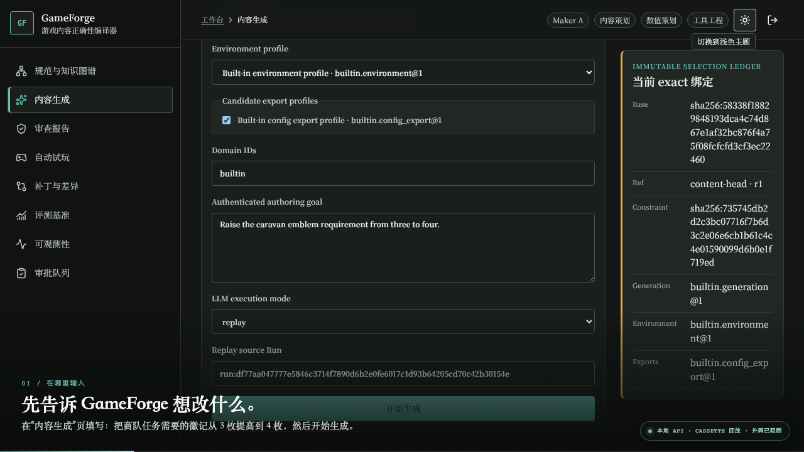</a>
</p>

演示使用 `replay` 和冻结的 source Run，因此可以复现同一次 Agent 提议；对错并不由这次 Agent 输出决定。

### 2. 检查候选，而不是把它当成成品

生成完成后，你会先看到 `generation_gate_passed` 与一条不可变候选链：**Patch → preview → config**。此时正式内容仍是原来的 3 / 3。

打开 Patch 的 **Base / Current / Proposed**，字段级 Diff 会把真正发生的变化摊开：`step:collect_emblem.count` 从 **3** 变成 **4**，而地图供给仍为 **3**。

<table>
  <tr>
    <td width="50%"><a href="docs/assets/readme/flow-02-candidate.png">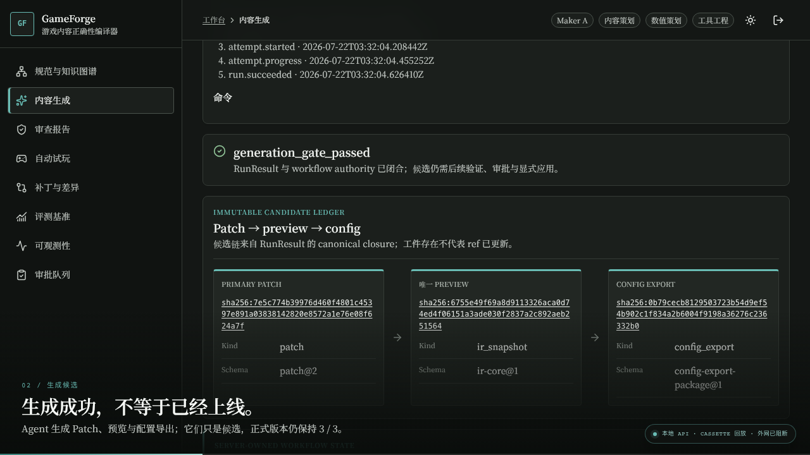</a></td>
    <td width="50%"><a href="docs/assets/readme/flow-03-diff.png">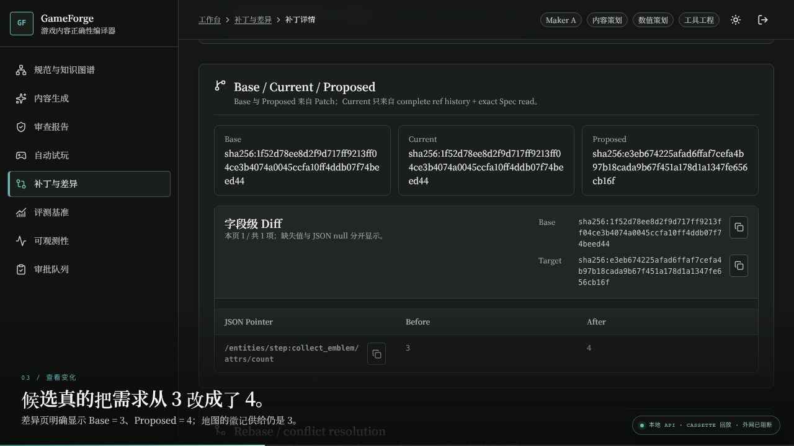</a></td>
  </tr>
  <tr>
    <td><strong>候选已生成</strong><br/><sub>生成门允许继续验证，但不会移动正式 ref。</sub></td>
    <td><strong>3 → 4 清楚可见</strong><br/><sub>Base、Current、Proposed 与 Before / After 都可检查。</sub></td>
  </tr>
</table>

### 3. 先 Review，再让真实游戏执行

进入 **审查报告**，启动候选 Review。确定性检查、仿真、LLM 建议和“尚未证明”会分区展示；本例即使确定性与仿真 Finding 都是 0，仍有 3 项尚未证明，不能跳过 Playtest。

随后派生精确绑定的任务集（exact TaskSuite），在 **自动试玩**启动 Playtest。可运行参考游戏 Aureus 会真正执行对话、采集、交付等任务步骤；本例由冻结的 `all-quests-completed` completion oracle 读取最终环境状态并判定任务是否完成。

<p align="center">
  <a href="docs/assets/readme/flow-04-review.png">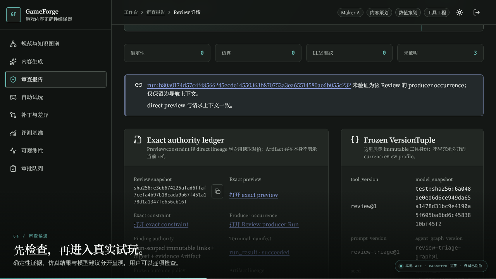</a>
</p>

### 4. 看见失败，并确认它没有进入正式版本

Playtest 最终判定任务未完成并留下可回放轨迹。从候选 Diff、场景供给和执行轨迹可以定位原因：任务要求 4 枚，但唯一采集点只给 3 枚。

回到 Patch，把本次 Review、Trace、Finding 与 RegressionSuite 绑定为 **Exact validation inputs**，点击 **启动 exact validation**。验证结果为失败；**Submit for independent approval** 与 **Apply approved Patch** 都不可用，正式版本指针（live ref）仍指向安全版本。

<table>
  <tr>
    <td width="50%"><a href="docs/assets/readme/flow-05-playtest-failure.png">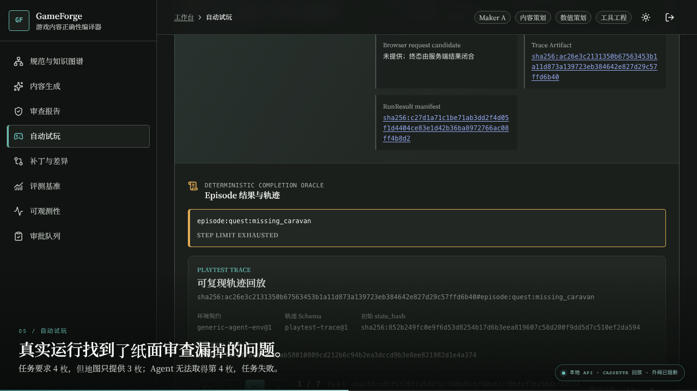</a></td>
    <td width="50%"><a href="docs/assets/readme/flow-06-release-blocked.png">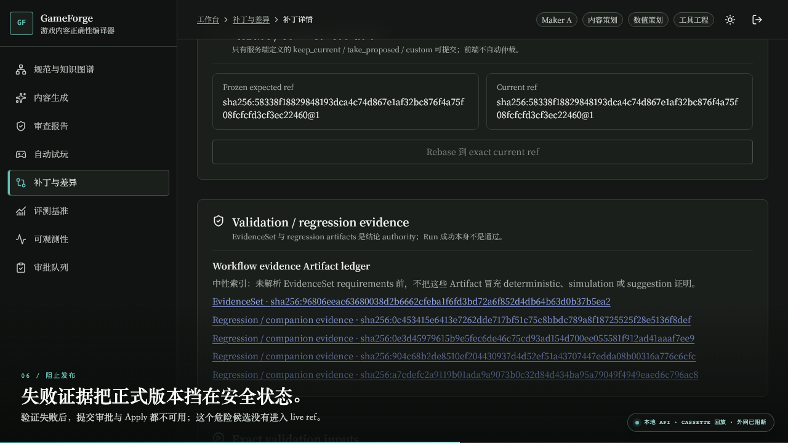</a></td>
  </tr>
  <tr>
    <td><strong>任务没有跑通</strong><br/><sub>权威结论是 bounded episode 内完成条件未满足。</sub></td>
    <td><strong>错误不能推动 live ref</strong><br/><sub>失败证据绑定精确 Patch revision，而不是一句模型解释。</sub></td>
  </tr>
</table>

### 5. 创建修复 revision，然后从头验证

点击 **Resolve 并启动 repair**。这次真实修复把不完整的 4 恢复为 3，并创建一个新的不可变 revision；旧候选、失败轨迹和旧审批记录都不会被覆写。

新 revision 必须重新 Review、重新派生 TaskSuite、重新 Playtest。需求与供给恢复为 3 / 3 后，任务完整通过并产生新的 Trace Artifact。

<table>
  <tr>
    <td width="50%"><a href="docs/assets/readme/flow-07-repair.png">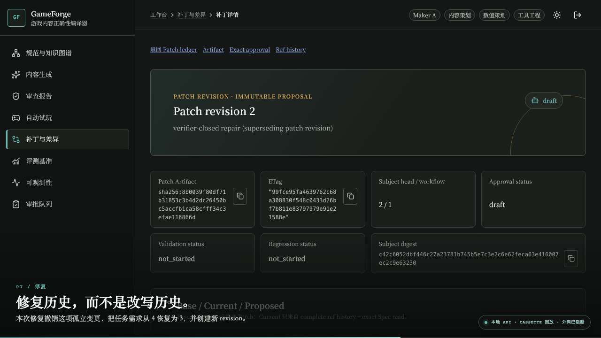</a></td>
    <td width="50%"><a href="docs/assets/readme/flow-08-regression-passed.png">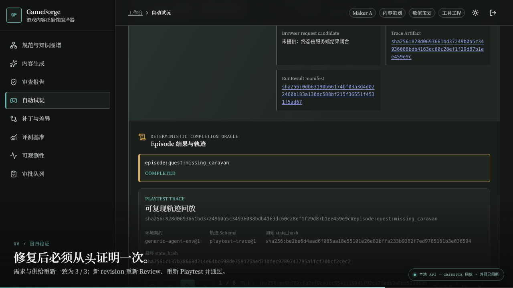</a></td>
  </tr>
  <tr>
    <td><strong>新建历史，不改写历史</strong><br/><sub>修复 revision 不继承旧候选的失败结论或审批。</sub></td>
    <td><strong>重新赢得证据</strong><br/><sub>新的 Review、validation 与 Playtest 都绑定新版本。</sub></td>
  </tr>
</table>

### 6. 第二个身份批准，最后才应用

验证通过后，提议者点击 **Submit for independent approval**。另一个有资格的身份检查 Requirement progress、填写原因并点击 **提交批准**；提议者不能批准自己的提议。

回到 Patch，点击 **Apply approved Patch** 并 **确认 Apply**。只有这一刻，`content-head` 的版本历史（ref history）才新增 revision；此前那个“需求 4、供给 3”的候选从未成为正式内容。

<table>
  <tr>
    <td width="50%"><a href="docs/assets/readme/flow-09-independent-approval.png">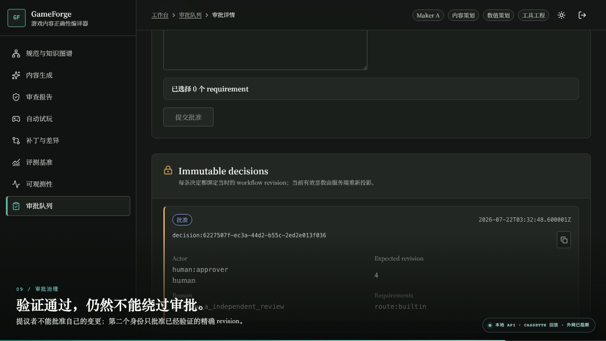</a></td>
    <td width="50%"><a href="docs/assets/readme/flow-10-live-ref-history.png">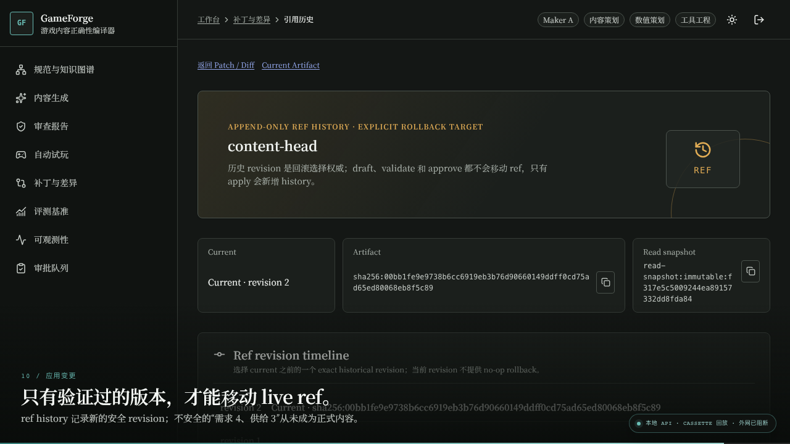</a></td>
  </tr>
  <tr>
    <td><strong>Maker / Checker 分离</strong><br/><sub>决定绑定精确 subject、target、digest 与 workflow revision。</sub></td>
    <td><strong>发布可追溯、可回滚</strong><br/><sub>draft、validate、approve 都不移动 ref，只有 apply 才新增历史。</sub></td>
  </tr>
</table>

## 八个页面分别做什么

| 页面 | 你在这里做什么 | 它回答的问题 |
|---|---|---|
| 规范与知识图谱 | 浏览版本化 Spec-IR、约束、来源和关系 | 当前内容事实究竟是什么？ |
| 内容生成 | 输入目标，生成 Patch / preview / config 候选 | Agent 实际提议了什么？ |
| 审查报告 | 分区检查确定性、仿真、建议与未证明结论 | 哪些结论有证据？ |
| 自动试玩 | 在 Aureus 中执行任务链并回放轨迹 | 游戏里真的跑通了吗？ |
| 补丁与差异 | 查看字段 Diff、验证、修复与 revision history | 哪个字段变了，为什么能发布？ |
| 评测基准 | 查看版本化报告、分母、置信区间和证据引用 | 产品能力有多少可复现证据？ |
| 可观测性 | 追踪 Run、Trace、日志、用量与预算 | 这次运行发生了什么、花了什么？ |
| 审批队列 | 审查精确目标并形成不可变决定 | 谁批准了哪个版本？ |

<details>
<summary><strong>展开查看 Spec、知识图谱、评测与可观测页面</strong></summary>
<br/>

<table>
  <tr>
    <td width="50%"><a href="docs/assets/readme/01-spec-authority.png"></a></td>
    <td width="50%"><a href="docs/assets/readme/02-knowledge-graph.png"></a></td>
  </tr>
  <tr><td><strong>Spec authority</strong></td><td><strong>Knowledge Graph</strong></td></tr>
  <tr>
    <td><a href="docs/assets/readme/10-eval-bench.png"></a></td>
    <td><a href="docs/assets/readme/11-observability.png"></a></td>
  </tr>
  <tr><td><strong>Eval / Bench</strong></td><td><strong>Observability</strong></td></tr>
</table>

</details>

## 为什么这些结论可信

GameForge 不让 LLM 充当正确性裁判。Agent 只负责抽取、分诊、生成与修复提议；确定性检查器与 completion oracle 给出可判定结论，仿真提供固定假设下的描述性证据，人工审批决定是否接受并发布已经验证的版本。

<p align="center">
  <a href="docs/assets/readme/product-loop.svg"></a>
</p>

- **可判定检查**：Graph、ASP / Clingo 与 SMT / z3 负责形式化、可判定的约束结论。
- **描述性仿真**：经济仿真在固定 seed 与假设下提供 what-if 证据，不冒充形式化证明。
- **真实执行环境**：Aureus 的任务、战斗、经济与抽卡系统由配置驱动，Playtest 必须在环境里真正完成。
- **精确版本绑定**：Artifact、ObjectRef、VersionTuple、Finding、Patch 与 EvidenceSet 把结论绑定到具体输入。
- **发布治理**：maker-checker 分离，apply 前重新校验 target、revision、evidence 与 ref。
- **可复现回放**：承诺固定 `model_snapshot + cassette + seed` 的回放，不承诺在线模型 bit 级一致。

代码依赖同样单向：`agents → spine`，永不 `spine → agents`；`spine` 不导入任何 LLM SDK。deterministic auto-apply 只适用于冻结策略允许、可证明且可校验的结构性修复，数值与叙事变更仍需人工审批。

## 可复现证据

| 验证范围 | 结果 | 结论边界 |
|---|---:|---|
| GameForge-Bench | **982** 个 seeded 样本 | 902 个 checker / simulation + 80 个 bounded narrative；冻结 `seed=0` |
| 确定性 / 仿真缺陷 | **11 类 × 82/82** 检出 | 每类 Wilson 95% 下界约 **95.5%**，不是“所有缺陷 100%” |
| Deterministic constraint-FP | **0/902** | 与 LLM-assisted narrative FP `6/381` 分开报告 |
| Agent 修复 | **10/10** | first-pass、runtime-vetted、cassette REPLAY；Wilson 95% CI **[72.2%, 100%]** |
| Playtest completion | flat `5/20` → layered `14/20` → memory `15/20` | 冻结的 20 条 / 组回放样本；Planner / Executor **+45pp**，MemTrace 再 **+5pp** |
| 真人 QA 病例研究 | manual `0/4`；GameForge-assisted `3/4` | 单一参与者、8 sessions / 4 matched pairs，不能泛化到所有用户 |
| QA 配对节省时间 | 平均 **3.41 min** | 95% bootstrap CI **[1.21, 5.04]**；错误 / 超时按预注册 8 分钟 cap |
| 产品表面 | **8 页 · 77 operations** | API 表面以 [`OpenAPI v1`](docs/api/openapi-v1.json) 为准 |

Bench 的完整分母、置信区间和 evidence refs 保存在版本化的 [`BenchReport`](scenarios/bench/bench-report.json)，不是 README 手写成绩。

## 三种游戏内容证据

<p align="center">
  <a href="docs/assets/readme/evidence-surfaces.svg"></a>
</p>

- **Aureus — 可运行参考游戏。** 确定性内核真实执行任务、战斗、经济与抽卡系统，是 Playtest Agent 的实际 Agent-Env。
- **Flare — 适配器完整性。** 精选真实配置片段可解析为 Spec-IR 并逐字节 round-trip；外部缺陷挖掘结论为 `insufficient_evidence`，没有被包装成缺陷有效性证明。
- **Endless Sky — 外部历史病例。** 冻结 8 个 qualified cases，覆盖 4 类缺陷的 development / verification 切分；每类仅 `n=1+1`，统计状态仍是 `underpowered`。

三者分别证明可执行闭环、格式完整性和外部证据流水线，不能合并成一个含糊的“支持三个游戏”数字。

## 在本地验证

核心验证要求 Python 3.12 与 [`uv`](https://docs.astral.sh/uv/)；浏览器回放另需 Node.js 24.18.0 与 npm 11.16.0。

```bash
uv python install 3.12
uv sync --frozen

# 真实配置 workbook → IR → Aureus；四个系统确定性完成
uv run python -m gameforge.apps.cli scenarios/outpost 0

# 干净基线经过 Graph / ASP / SMT / simulation review
uv run python -m gameforge.apps.cli review scenarios/defects/clean scenarios/constraints 0

# 验证版本化 BenchReport 的全部 acceptance 约束
uv run python -m gameforge.bench.acceptance \
  --report scenarios/bench/bench-report.json \
  --repo-root .
```

预期关键结果：Aureus `completed=true` 并覆盖 `combat / economy / gacha / quest`；clean review 分栏显示 `deterministic_findings=0`、`llm_assisted_findings=1`、`simulation_findings=1`、`unproven=0`；Bench acceptance 返回空错误列表。

要重放 README 展示的完整浏览器流程：

```bash
cd web
npm ci
npm exec playwright install chromium
npm run test:e2e -- --headed --grep \
  "proves generation, review, playtest, repair, approval, and exact apply over real authority"
```

该命令在临时 workspace 中启动真实本地 API、worker 与浏览器；产品 API 不被 mock / intercept，浏览器与 launcher 的外部网络 fail-closed。

## 来源与许可

- 主流程截图与视频来自同一条真实本地流程；输入镜头在真实点击“开始生成”之前捕获，后续候选、Review、Playtest、修复、审批与 ref history 都来自这次提交的真实工件。补充页面图与完整媒体校验见 [`docs/assets/readme/README.md`](docs/assets/readme/README.md)。
- 仓库只收录 Flare 的精选真实配置片段，不包含上游 engine code；CC BY-SA 3.0 来源与归属见 [`scenarios/flare_sample/NOTICE`](scenarios/flare_sample/NOTICE)，上游 engine code 本身为 GPL-3.0。
- Endless Sky 外部病例遵循 `GPL-3.0-or-later`；归属见 [`NOTICE`](scenarios/external_corpus/endless_sky/NOTICE)，冻结来源与 pin 见 [`source-profile.json`](scenarios/external_corpus/endless_sky/source-profile.json)。
- 仓库根目录未发布 LICENSE，请勿据此推定开源授权。

<p align="center"><sub>Correctness before confidence · Evidence before claims · Policy before release</sub></p>
