<p align="center"><sub>PROJECT CODENAME · GAME CONTENT CORRECTNESS</sub></p>

<h1 align="center">GameForge</h1>

<p align="center"><strong>让游戏内容可以被证明。</strong></p>

<p align="center">
  面向游戏内容的<strong>正确性编译器 + 生产级 Agent 工作台</strong>：<br/>
  把策划案与配置表编译成可版本化的 Design-Spec IR，
  用确定性检查器和真实 Playtest 裁决，再按冻结策略经人工批准或 deterministic auto-apply 受控发布。
</p>

<p align="center">
  <code>Graph</code> · <code>Clingo</code> · <code>z3</code> · <code>Economy Simulation</code> · <code>Bounded Agents</code> · <code>Frozen Policy</code> · <code>Human Approval</code>
</p>

<p align="center"><sub>deterministic auto-apply 仅限冻结策略允许、可证明且可校验的结构性修复；数值与叙事变更仍必须人工审批。</sub></p>

<p align="center">
  <strong>M0–M3 已完成</strong>　·　<strong>M4a–M4d 已完成</strong>　·　M4e production / DR adapters 待推进
</p>

<br/>

<p align="center">
  <a href="https://github.com/MicroYui/game-forge/raw/refs/heads/master/docs/assets/readme/gameforge-journey-a-silent-v2-zh.webm">
    
  </a>
</p>

<p align="center">
  <a href="https://github.com/MicroYui/game-forge/raw/refs/heads/master/docs/assets/readme/gameforge-journey-a-silent-v2-zh.webm"><strong>▶ 观看约 84 秒中文无配音演示</strong></a><br/>
  <sub>7.31 MiB · 同一次真实本地 Journey A · 本地 API / worker · cassette 回放 · 外网阻断 · 1280 × 720</sub>
</p>

## 30 秒看懂 GameForge

GameForge 不让 LLM 判断游戏内容“对不对”。它把内容生产变成一条可以验证、回放和审计的编译流水线：Agent 负责提出可能性，确定性检查器、真实环境，以及冻结发布策略与审批人掌握最终裁决权。

<p align="center">
  <a href="docs/assets/readme/product-loop.svg">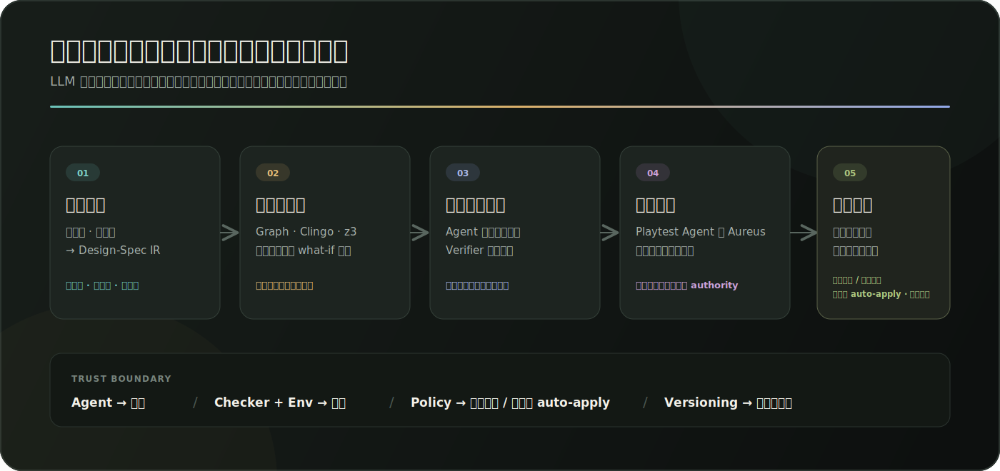</a>
</p>

| 冻结证据 | 当前结果 | 结论边界 |
|---|---:|---|
| GameForge-Bench | **982** 个 seeded 样本 | 902 个 checker / simulation + 80 个 bounded narrative；冻结 `seed=0` |
| 确定性 / 仿真缺陷 | **11 类 × 82/82** 检出 | 每类 Wilson 95% 下界约 **95.5%**，不是“所有缺陷 100%” |
| 约束误报 | **0/902** | 仅指冻结 deterministic constraint-FP 口径 |
| Agent 修复 | **10/10** | cassette REPLAY；Wilson 95% CI **[72.2%, 100%]** |
| 产品表面 | **8 页 · 77 operations** | exact OpenAPI；M4e production / DR adapters 尚未完成 |

前四项来自版本化的 [`BenchReport v2`](scenarios/bench/bench-report.json)；产品表面来自 [`OpenAPI v1`](docs/api/openapi-v1.json) 与 [M4d 验收记录](docs/superpowers/plans/2026-07-19-m4d-web-console.md)。它们都不是 README 手写成绩。

## 一条真实闭环，不是一组静态页面

### Journey A · 从创作到可发布变更

1. 策划内容进入 **Spec / Knowledge Graph**，实体、关系、约束与来源可追溯。
2. Agent 生成候选内容，但只能停在 **proposal**；生成门决定是否允许继续。
3. Review 把 **确定性、仿真、LLM 建议、未证明**分栏，证据不会被混写。
4. Playtest Agent 在真实可运行的 **Aureus** 中执行任务链；环境是 `done` 的唯一 authority。
5. 失败轨迹与验证证据驱动 Patch revision；旧版本不可变，新版本重新 Review 与 Playtest。
6. 第二身份批准 exact revision 后，平台精确应用并保留回滚、ref history 与审计轨迹。

<table>
  <tr>
    <td width="50%"><a href="docs/assets/readme/02-knowledge-graph.png">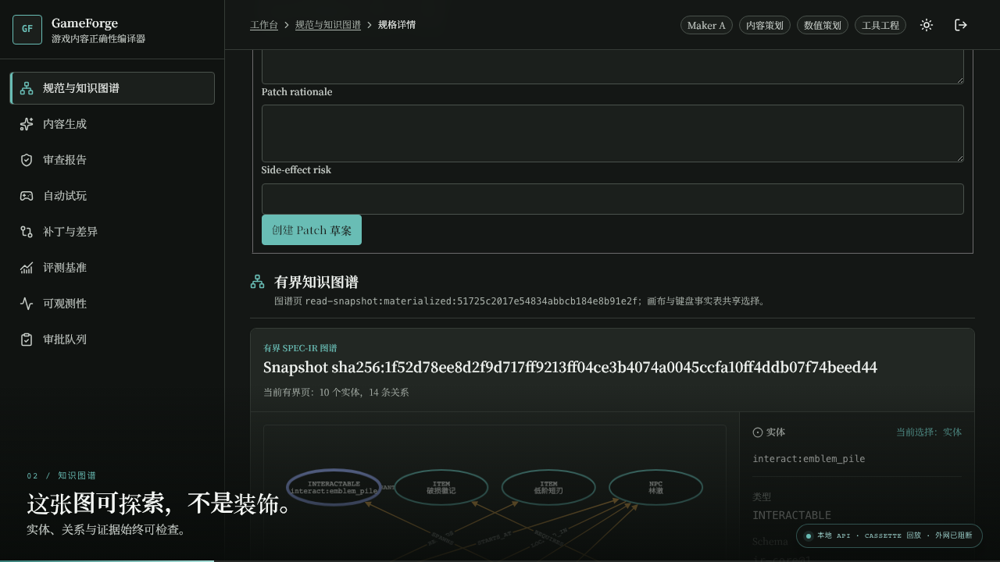</a></td>
    <td width="50%"><a href="docs/assets/readme/03-generation-gate.png">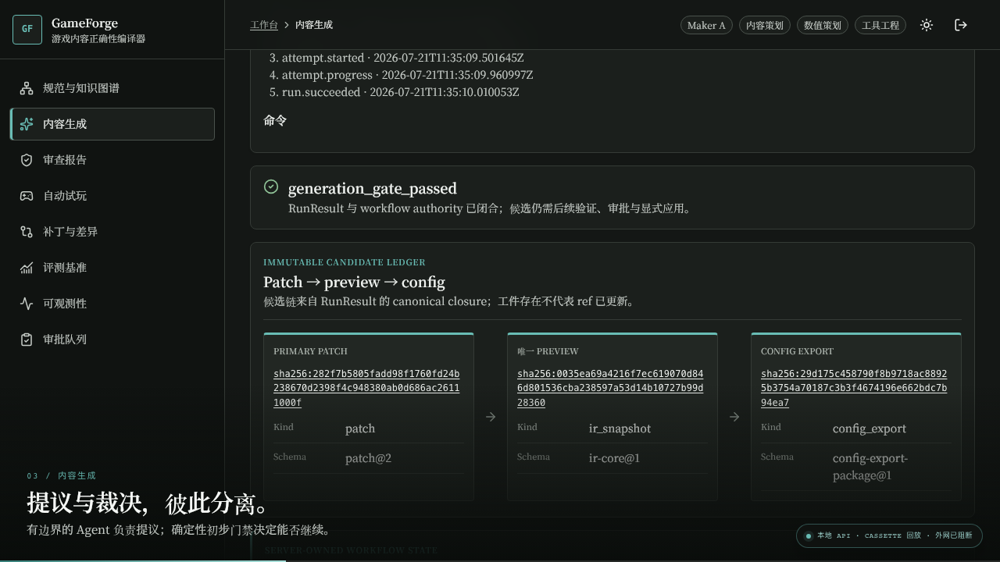</a></td>
  </tr>
  <tr>
    <td><strong>可探索的 Spec-IR</strong><br/><sub>10 个实体、14 条关系；画布、键盘与事实表共享选择。</sub></td>
    <td><strong>提议与裁决分离</strong><br/><sub>Patch → exact preview → config export，候选仍需验证和审批。</sub></td>
  </tr>
</table>

### 失败 → 修复 → 回归通过

失败不会被漂亮地隐藏，也不能推动 live ref。修复产生新的不可变 revision，并重新赢得一整组证据。

<table>
  <tr>
    <td width="50%"><a href="docs/assets/readme/05-playtest-failure.png">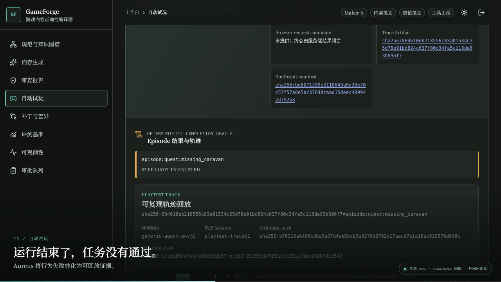</a></td>
    <td width="50%"><a href="docs/assets/readme/08-playtest-regression.png">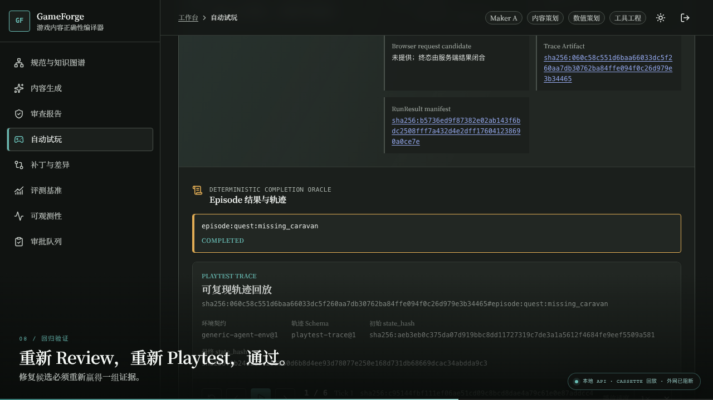</a></td>
  </tr>
  <tr>
    <td><strong>Before · STEP LIMIT EXHAUSTED</strong><br/><sub>失败被固化为可回放轨迹，而不是一句模型解释。</sub></td>
    <td><strong>After · COMPLETED</strong><br/><sub>新的候选重新 Review、重新 Playtest，生成新的 Trace Artifact。</sub></td>
  </tr>
</table>

### Journey B · 审批、精确应用与回滚

GameForge 把“谁可以改变什么”当作产品能力，而不是后台备注：maker 不能批准自己的 proposal；历史票据在身份或目标变化后重新验权；apply 前再次校验 exact target、revision、evidence 与 ref。

下图来自同一次 Journey A 的审批 / apply 段；独立 Journey B 真实浏览器 E2E 另行覆盖 rollback、冲突重建与 SSE `Last-Event-ID` 恢复。

<table>
  <tr>
    <td width="50%"><a href="docs/assets/readme/09-maker-checker-approval.png">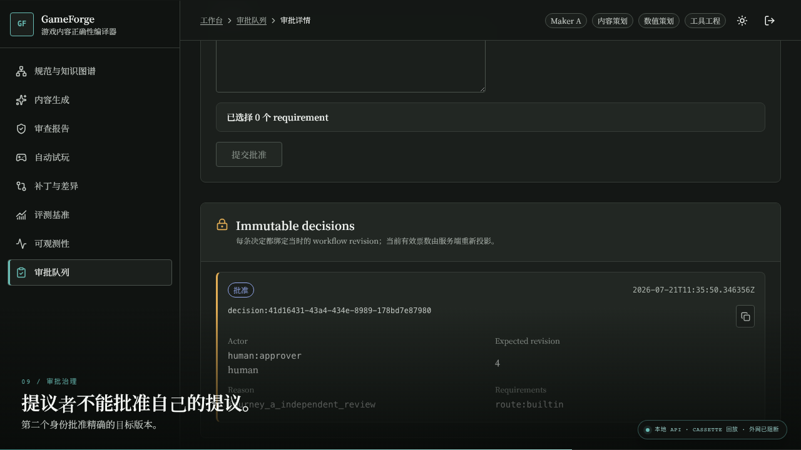</a></td>
    <td width="50%"><a href="docs/assets/readme/07-repair-revision.png">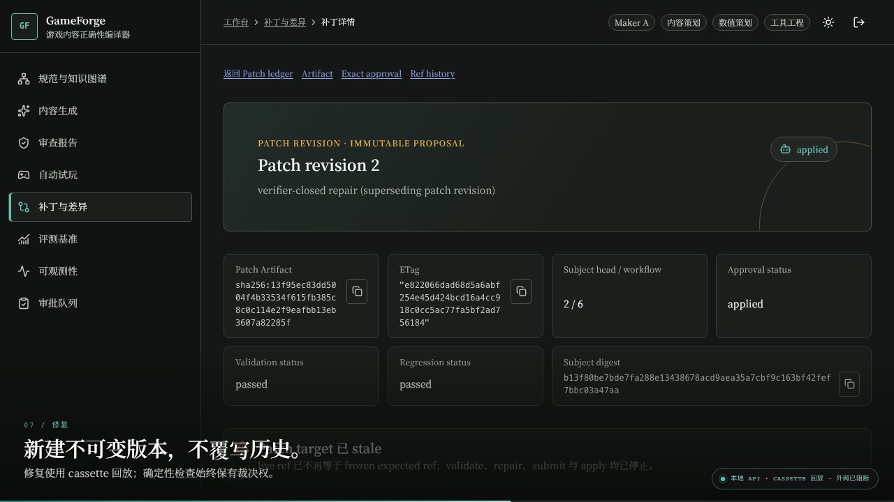</a></td>
  </tr>
  <tr>
    <td><strong>Maker / Checker 分离</strong><br/><sub>第二身份批准精确绑定的目标版本，决定本身不可变。</sub></td>
    <td><strong>新建版本，不覆写历史</strong><br/><sub>validation 与 regression 均通过后才可 applied。</sub></td>
  </tr>
</table>

## 八页生产工作台

不是“Dashboard + 七张占位卡”。每一页都绑定自己的 authority、失败状态和跨页证据链。

| 页面 | 回答的问题 | 核心能力 |
|---|---|---|
| Spec / Knowledge Graph | 当前设计事实是什么？ | 版本化 IR、约束、来源、图谱探索、Patch 草案 |
| Generation | Agent 实际提议了什么？ | Run / attempt、生成门、候选与导出账本 |
| Review | 哪些结论已经被证明？ | finding 分栏、exact authority、冻结 VersionTuple |
| Playtest | 游戏里真的跑通了吗？ | Aureus 执行、确定性 completion oracle、可回放轨迹 |
| Patch / Diff | 修复改变了什么？ | exact-base diff、验证 / 回归证据、revision history |
| Eval / Bench | 产品能力有多少证据？ | 版本化报告、分母、CI、缺失证据显式化 |
| Observability | 一次运行花了什么、发生了什么？ | trace、usage、预算结算、RBAC 拒绝也保留 request / trace 关联 |
| Approvals | 谁批准了哪个精确目标？ | 双身份、逐动作 eligibility、partial / terminal decision |

<details>
<summary><strong>展开查看八页完整图例</strong></summary>
<br/>

<table>
  <tr>
    <td width="50%"><a href="docs/assets/readme/01-spec-authority.png">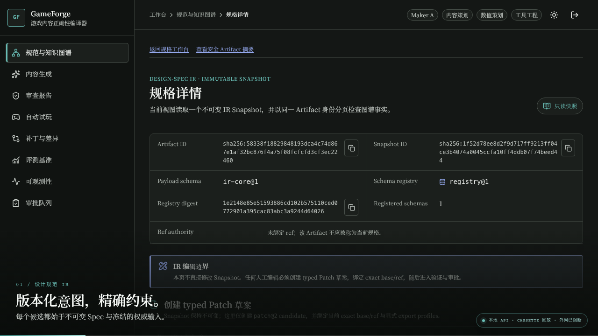</a></td>
    <td width="50%"><a href="docs/assets/readme/03-generation-gate.png"></a></td>
  </tr>
  <tr><td><strong>01 · Spec / KG</strong></td><td><strong>02 · Generation</strong></td></tr>
  <tr>
    <td><a href="docs/assets/readme/04-review-evidence.png">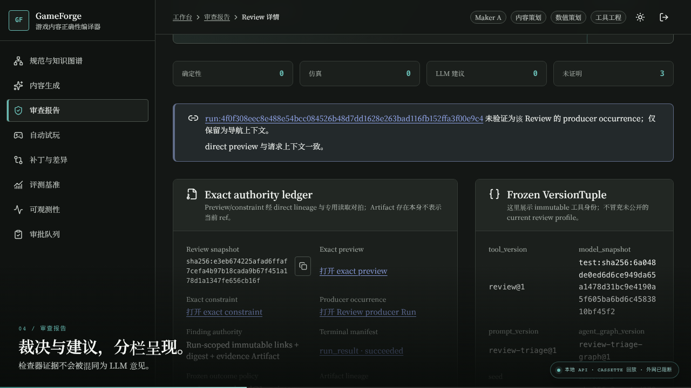</a></td>
    <td><a href="docs/assets/readme/05-playtest-failure.png"></a></td>
  </tr>
  <tr><td><strong>03 · Review</strong></td><td><strong>04 · Playtest</strong></td></tr>
  <tr>
    <td><a href="docs/assets/readme/06-validation-failure.png">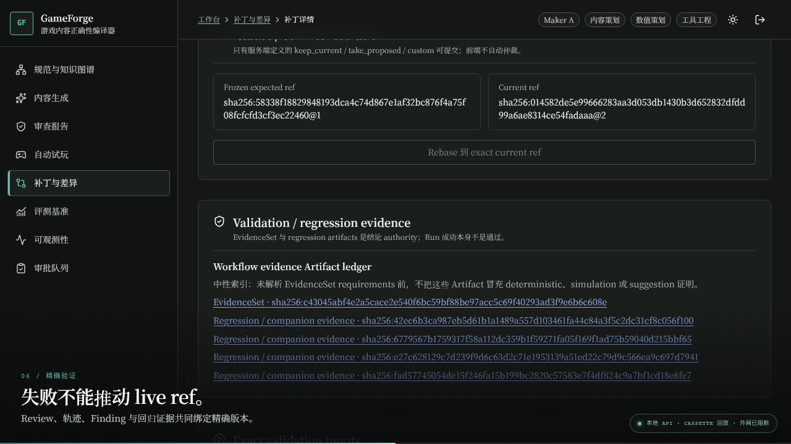</a></td>
    <td><a href="docs/assets/readme/10-eval-bench.png">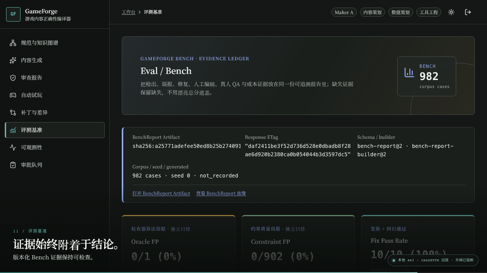</a></td>
  </tr>
  <tr><td><strong>05 · Patch / Diff</strong></td><td><strong>06 · Eval / Bench</strong></td></tr>
  <tr>
    <td><a href="docs/assets/readme/11-observability.png">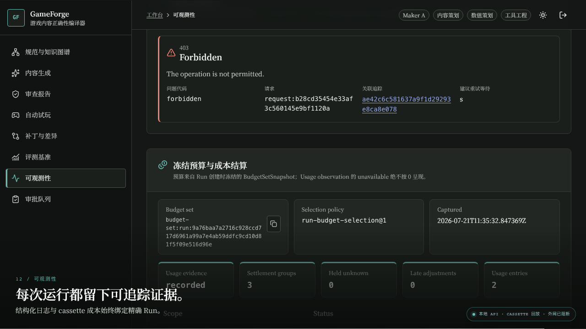</a></td>
    <td><a href="docs/assets/readme/09-maker-checker-approval.png"></a></td>
  </tr>
  <tr><td><strong>07 · Observability</strong></td><td><strong>08 · Approvals</strong></td></tr>
</table>

</details>

## 三个游戏 / 数据源，三种不同证明

<p align="center">
  <a href="docs/assets/readme/evidence-surfaces.svg">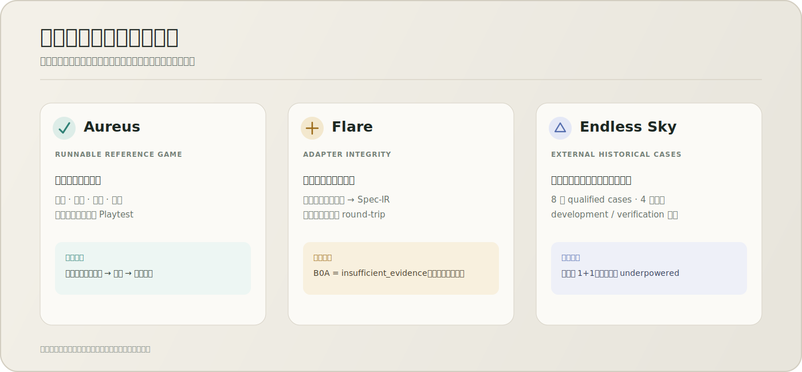</a>
</p>

- **Aureus — 可运行参考游戏。** 仓库内的确定性内核真实执行任务、战斗、经济与抽卡系统，是 Playtest Agent 的实际 Agent-Env。
- **Flare — 适配器完整性。** 真实上游配置片段可解析为 Spec-IR 并逐字节 round-trip；B0A 外部缺陷挖掘终态为 `insufficient_evidence`，因此没有被包装成真实缺陷有效性证明。
- **Endless Sky — 外部历史病例。** 冻结 **8 个 qualified cases**，覆盖 4 类缺陷的 development / verification 切分；每类仅 `n=1+1`，统计状态仍是 `underpowered`，不能外推为广泛跨游戏泛化。

这三者刻意不合并成一个“支持三个游戏”的营销数字：它们分别证明可执行闭环、格式完整性和外部证据流水线。

## 确定性主干 + 有边界的 Agent

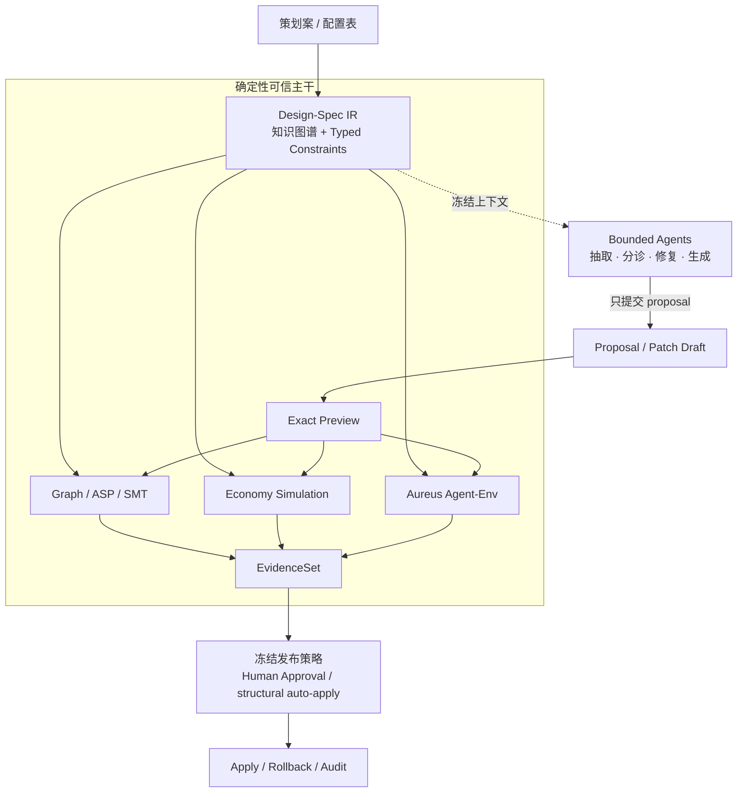

代码依赖同样单向：`agents → spine`，永不 `spine → agents`。`spine` 禁止导入任何 LLM SDK；LLM 输出必须由确定性预言机或人工兜底。deterministic auto-apply 只覆盖可证明、可校验的结构性修复，数值与叙事变更仍由人批准。可复现承诺是固定 `model_snapshot + cassette + seed` 的**回放**，不承诺在线模型 bit 级一致。

<details>
<summary><strong>查看仓库边界</strong></summary>

```text
gameforge/
  contracts/     # Artifact / ObjectRef / VersionTuple / IR / Finding / Patch
  spine/         # 确定性可信主干：checkers、DSL、simulation、versioning
  runtime/       # persistence、model router、transport、基础能力
  env/           # Agent-Env 接口
  game/aureus/   # 可运行的确定性参考游戏
  agents/        # 有边界的 LLM / Playtest agents
  platform/      # RBAC、审批、运行、发布与可观测领域服务
  bench/         # GameForge-Bench 与证据聚合
  apps/api/      # HTTP / SSE / WS composition boundary
  apps/worker/   # worker composition
  apps/cli/      # CLI composition
web/             # React + TypeScript 生产工作台
scenarios/       # Aureus、缺陷、约束与冻结 benchmark 证据
```

</details>

## 可复现证据，而不是一个百分比

| 范围 | 结果 | 解释 |
|---|---:|---|
| Seeded checker / simulation | 11 类均 `82/82` | 10 类 deterministic + 1 类 economy simulation |
| Deterministic constraint-FP | `0/902` | 与 LLM-assisted narrative FP 分开报告；后者为 `6/381` |
| Fix Pass Rate | `10/10` | first-pass、runtime-vetted；cassette REPLAY |
| Playtest completion | flat `5/20` → layered `14/20` → memory `15/20` | M2 历史冻结 cassette、每臂 20 条；Planner / Executor **+45pp**，MemTrace 再 **+5pp** |
| 真人 QA 病例研究 | manual success `0/4`；GameForge-assisted success `3/4` | 单一参与者、8 sessions / 4 matched pairs；不能泛化到所有用户 |
| QA 配对节省时间 | 平均 **3.41 min** | 95% bootstrap CI **[1.21, 5.04]**；错误 / 超时按预注册 8 分钟 cap |
| M4d 浏览器验收 | 8 页、70 项视觉证据、21 项 a11y / 键盘检查、5 条浏览器旅程 | 不是 WCAG 认证 |

Bench 指标的完整口径、分母、置信区间和 evidence refs 保存在 [`scenarios/bench/bench-report.json`](scenarios/bench/bench-report.json)；M4d 浏览器验收数量保存在 [实现计划的完成记录](docs/superpowers/plans/2026-07-19-m4d-web-console.md)。

## 快速跑通确定性主干

要求：Python 3.12 与 [`uv`](https://docs.astral.sh/uv/)。以下命令已在当前仓库状态实际验证。

```bash
uv python install 3.12
uv sync --frozen

# 真实配置 workbook → IR → Aureus；四个系统确定性完成
uv run python -m gameforge.apps.cli scenarios/outpost 0

# 干净基线经过 Graph / ASP / SMT / simulation review
uv run python -m gameforge.apps.cli review scenarios/defects/clean scenarios/constraints 0

# 验证版本化 BenchReport 的全部 acceptance 约束
uv run python -m gameforge.bench.acceptance \
  --report scenarios/bench/bench-report.json \
  --repo-root .
```

预期关键结果：Aureus `completed=true` 并覆盖 `combat / economy / gacha / quest`；clean review 的 `deterministic_findings=0`；Bench acceptance 返回空错误列表。

<details>
<summary><strong>Web 工作台开发门禁</strong></summary>

```bash
cd web
npm ci
npm exec playwright install chromium
npm run contracts:check
npm run typecheck
npm test
npm run build
```

完整产品旅程由 Playwright 启动真实本地 API / worker composition；当前尚未把这套编排包装成面向最终用户的一键 launcher，production / DR adapters 归属 M4e。

</details>

## 当前完成度

| 里程碑 | 交付 | 状态 |
|---|---|:---:|
| M0a–M0b | Contracts、IR、Aureus 四系统、Schema Registry、版本 / 血缘 / 审计地基 | ✅ |
| M1 | Graph / ASP / SMT、DSL 编译、经济仿真、Finding / Patch | ✅ |
| M2 | 有边界 Agent、Playtest、MemTrace、Model Router / cassette | ✅ |
| M3 | 982 seeded Bench、完整指标、外部历史病例、真人 QA、Eval 证据面板 | ✅ |
| M4a | 平台核心与持久化 | ✅ |
| M4b | 可观测、成本治理与可靠性 | ✅ |
| M4c | API、RBAC、审批、streaming、真实本地 composition | ✅ |
| M4d | 八页 React 工作台、Journey A / B、隔离 QA Runner、视觉 / 浏览器门禁 | ✅ |
| M4e | Production / DR adapters | ⏳ |

## 深入阅读

- [产品需求文档](docs/superpowers/specs/2026-07-03-gameforge-prd.md) — 定位、子系统、指标与里程碑验收
- [地基契约 v0.3](docs/superpowers/specs/2026-07-03-gameforge-foundations-contracts.md) — Artifact、ObjectRef、VersionTuple 与依赖边界
- [M4 生产化最终设计](docs/superpowers/specs/2026-07-13-m4-production-hardening-design.md) — 五片边界、跨模块契约、API / UI / 运维验收
- [M4d 实现计划](docs/superpowers/plans/2026-07-19-m4d-web-console.md) — 八页工作台、视觉门禁、Journey 与 QA 证据
- [README 媒体来源说明](docs/assets/readme/README.md) — 截图、录像与示意图的生成方式和边界

## 来源、许可与边界

- 演示截图与视频来自同一次本地 Journey A 录制；使用真实 API / worker 与冻结 cassette 回放，录制期间外部网络被阻断。画面中的时间、哈希、身份与业务内容属于测试证据。
- 仓库只收录 Flare 的精选真实配置片段，不包含上游 engine code；片段的 CC BY-SA 3.0 来源与归属见 [`scenarios/flare_sample/NOTICE`](scenarios/flare_sample/NOTICE)，上游 engine code 本身为 GPL-3.0。
- Endless Sky 外部病例遵循 `GPL-3.0-or-later`；归属见本地 [`NOTICE`](scenarios/external_corpus/endless_sky/NOTICE)，冻结来源与 pin 见 [`source-profile.json`](scenarios/external_corpus/endless_sky/source-profile.json)。
- GameForge 是当前**项目代号**。仓库根目录目前未发布 LICENSE，请勿据此推定开源授权。

<p align="center"><sub>Correctness before confidence · Evidence before claims · Policy before release</sub></p>
