<p align="center"><sub>GAME CONTENT CORRECTNESS COMPILER · AGENT WORKBENCH</sub></p>

<h1 align="center">GameForge</h1>

<p align="center"><strong>让 AI 加速创作，让证据决定能否发布。</strong></p>

<p align="center">
  从策划材料构建可版本化的 Design-Spec IR，<br/>
  用确定性检查、经济仿真与真实 Playtest 验证候选，再经审批写入正式游戏内容。
</p>

<p align="center">
  <code>Project-first authoring</code> · <code>Graph / ASP / SMT</code> · <code>Economy simulation</code> · <code>Bounded agents</code> · <code>Human approval</code>
</p>

<br/>

<p align="center">
  <a href="https://github.com/MicroYui/game-forge/raw/refs/heads/master/docs/assets/readme/gameforge-project-workflow-zh.mp4">
    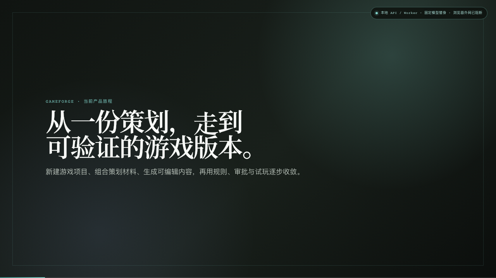
  </a>
</p>

<p align="center">
  <a href="https://github.com/MicroYui/game-forge/raw/refs/heads/master/docs/assets/readme/gameforge-project-workflow-zh.mp4"><strong>▶ 下载 / 播放 93 秒中文无配音演示</strong></a><br/>
  <sub>创建项目 → 加入材料 → AI 提案与身份归一 → 图谱编辑 → 内容 v1 → 项目规则 → 内容 v2 → 自动试玩</sub>
</p>

## GameForge 现在是什么

GameForge 是面向游戏内容的**正确性编译器与生产级 Agent 工作台**。它把分散在策划文档、配置表和已有版本里的内容，编译成可追溯的实体、关系与约束；Agent 可以提取、生成和修复候选，但不能自行宣布候选正确，也不能绕过治理直接发布。

它同时解决两件通常被拆开的事：

- **持续创作**：一个游戏项目长期保存多份材料、多次 AI 提案、内容版本、项目规则和运行证据；后续生成建立在项目当前状态上，而不是每次重新向模型解释全世界。
- **可判定验证**：Graph、ASP / Clingo、SMT / z3、经济仿真和 Aureus Playtest 分别回答结构、数值与可运行性问题；无法证明时明确给出 `unproven` 或失败，而不是让 LLM 打分。

| 谁负责 | 可以做什么 | 不能做什么 |
|---|---|---|
| LLM Agent | 抽取实体关系、起草规则、生成与修复 Patch、提示风险 | 充当正确性裁判、静默改写正式版本 |
| 确定性主干 | 检查图约束、编译 DSL、求解 ASP / SMT、运行仿真与 completion oracle | 判断主观“好不好玩” |
| Human | 修订候选、处理语义冲突、审批或拒绝精确版本 | 用口头批准替代证据与版本绑定 |

GameForge 不是游戏引擎，也不是“一句话生成整款游戏”的演示器。Aureus 是仓库内可运行的参考游戏，用来证明内容能否在真实环境中闭环。

## 当前产品旅程：天空港计划

下面 9 张图与顶部视频来自**同一次 Playwright 执行**。用例在 fresh workspace 启动真实本地 API、worker 与浏览器；产品 API 没有被 mock 或 intercept。为了让结果可复现且不消耗在线模型额度，Agent 侧使用固定模型替身，浏览器与 launcher 的外部网络均被阻断。

### 1. 建立项目并保存原始材料

策划先创建“天空港计划”，再粘贴飞书 Block JSON。项目可以长期保留并组合 1–64 份飞书文本、Markdown、HTML、JSON、DOCX、XLSX 或 CSV 材料；材料、解析结果和来源记录是项目资产，不是一次对话的临时附件。

<table>
  <tr>
    <td width="50%"><a href="docs/assets/readme/project-flow-01-project.png">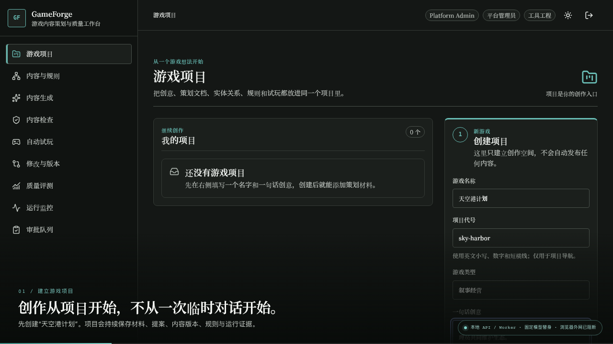</a></td>
    <td width="50%"><a href="docs/assets/readme/project-flow-02-material.png">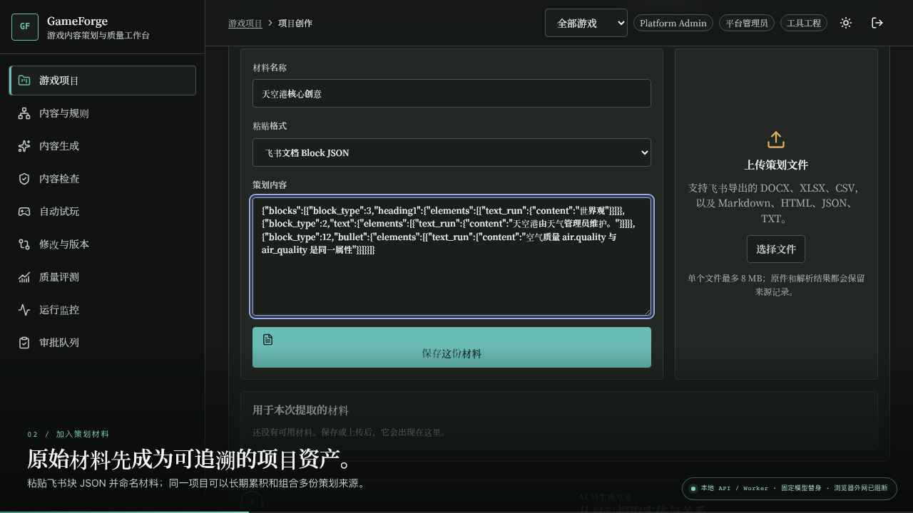</a></td>
  </tr>
  <tr><td><strong>项目是持续创作空间</strong></td><td><strong>原始材料可追溯</strong></td></tr>
</table>

### 2. 提取候选、消解身份并编辑图谱

AI 从材料中提取实体和关系，但结果仍是可编辑候选。确定性身份归一把 `air.quality`、`air_quality` 与规范标识识别为同一内容组；有歧义时必须由人处理。策划随后补充“云港向导”，并建立它与天空港的关系。

<table>
  <tr>
    <td width="50%"><a href="docs/assets/readme/project-flow-03-proposal.png">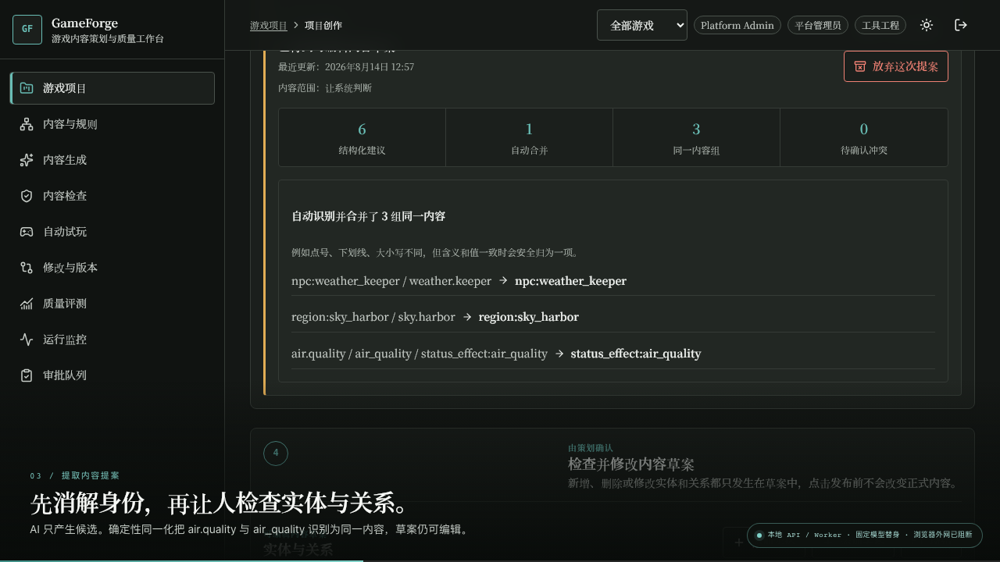</a></td>
    <td width="50%"><a href="docs/assets/readme/project-flow-04-graph-edit.png">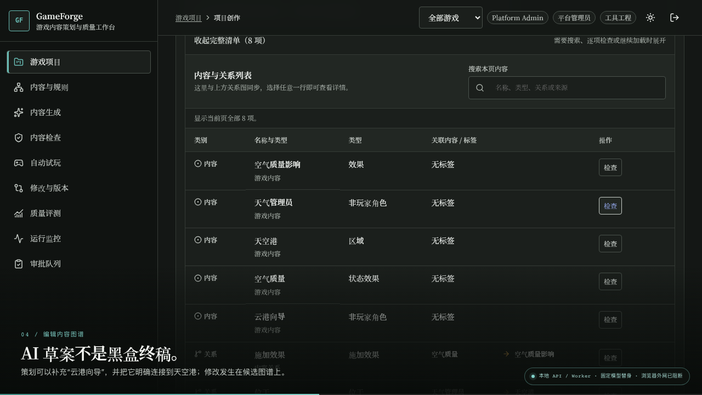</a></td>
  </tr>
  <tr><td><strong>别名先归一，冲突不猜测</strong></td><td><strong>AI 草案不是黑盒终稿</strong></td></tr>
</table>

### 3. 发布内容 v1，再建立项目规则

编辑后的候选创建不可变 Patch，经过确定性验证、审批与 Apply 后，项目首页才显示“第 1 版内容”。演示使用 `platform_admin` 的**显式自审**能力；普通 maker 仍不能批准自己的提案。

同一项目随后从材料提取“任务依赖必须无环”的规则提案。Human 可以修订文本，约束编译器和验证器给出确定性证据，审批完成后才发布为项目权威约束。项目规则也支持 required-attribute 约束，并会在后续候选验证中执行。

<table>
  <tr>
    <td width="50%"><a href="docs/assets/readme/project-flow-05-content-v1.png">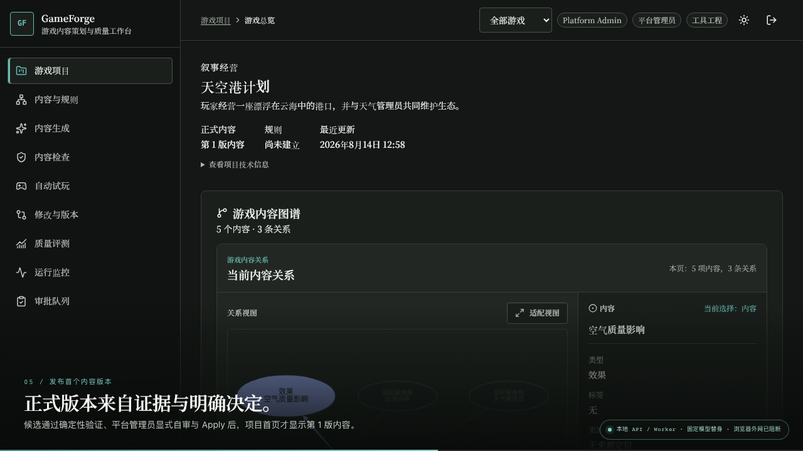</a></td>
    <td width="50%"><a href="docs/assets/readme/project-flow-06-rules.png">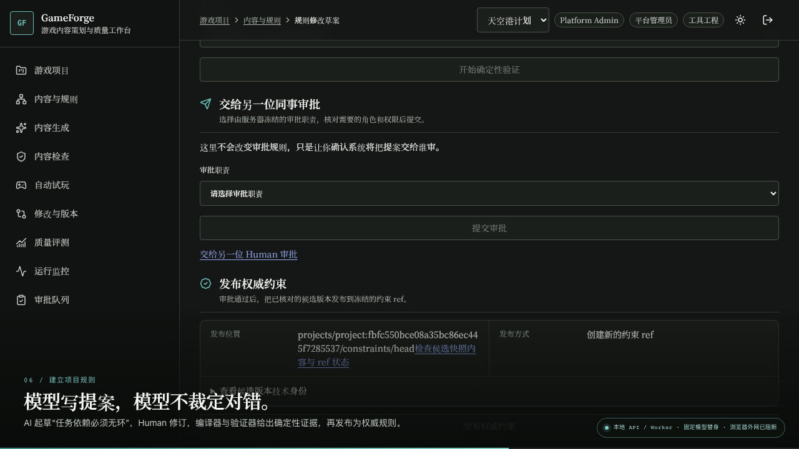</a></td>
  </tr>
  <tr><td><strong>内容版本来自证据与决定</strong></td><td><strong>模型写提案，模型不裁定对错</strong></td></tr>
</table>

### 4. 基于项目现状继续生成内容 v2

后续生成绑定项目当前内容、相关材料、已发布规则与有界 grounding slice，而不是把整张图无差别塞进 prompt。本例新增“风暴观测员”；新候选重新经历验证、审批与 Apply，项目进入第 2 版，旧版本和发布历史仍被保留。

<table>
  <tr>
    <td width="50%"><a href="docs/assets/readme/project-flow-07-continuation.png">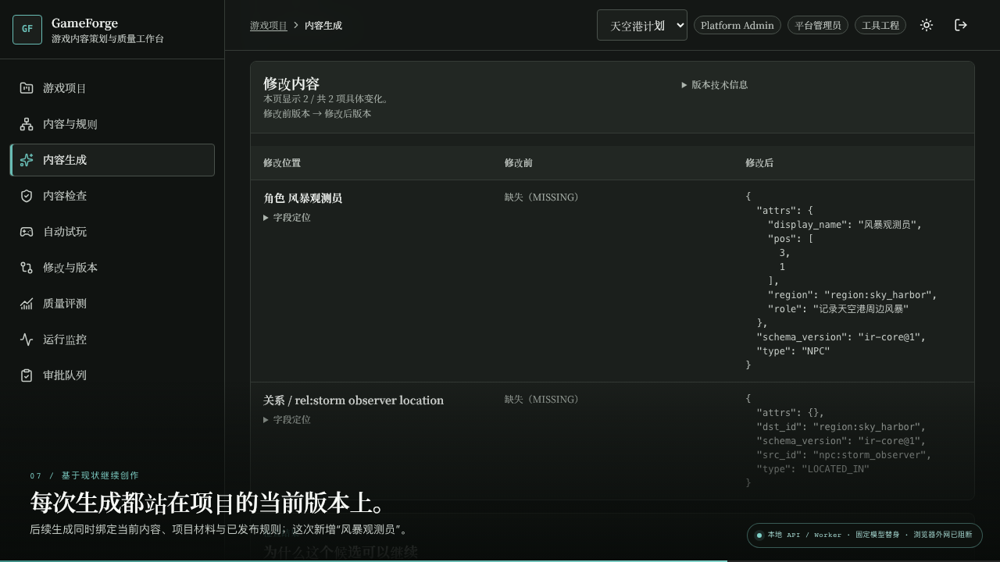</a></td>
    <td width="50%"><a href="docs/assets/readme/project-flow-08-content-v2.png">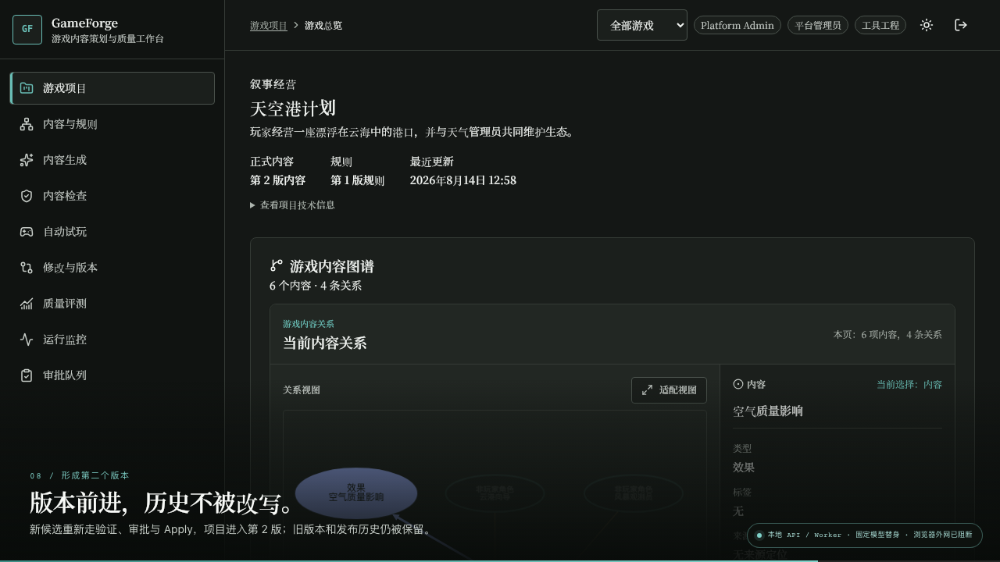</a></td>
  </tr>
  <tr><td><strong>生成建立在当前 authority 上</strong></td><td><strong>版本前进，历史不被改写</strong></td></tr>
</table>

### 5. 让真实 Playtest 说“不够”

项目可以从当前版本派生 TaskSuite 并启动自动试玩。本次材料没有定义完整可玩的任务链，因此 completion oracle 返回 **0 / 1 完成**，页面明确显示“仍有试玩任务未完成”。这是当前演示的真实终点：证据不足时给失败结果，不为首页视频伪造一次绿色成功。

<p align="center">
  <a href="docs/assets/readme/project-flow-09-playtest.png">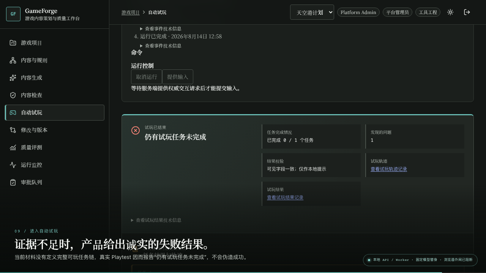</a>
</p>

## 为什么这些结论可信

<p align="center">
  <a href="docs/assets/readme/product-loop.svg">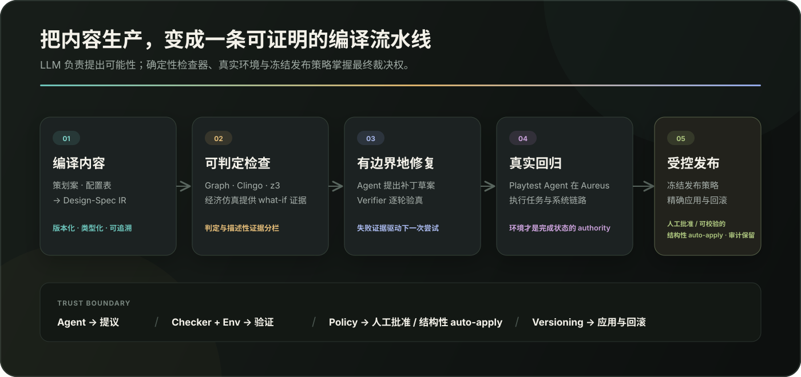</a>
</p>

- **可判定检查**：Graph、ASP / Clingo 与 SMT / z3 负责形式化约束；`unknown`、超时或超预算必须标为 `unproven`，不能冒充通过。
- **描述性仿真**：经济仿真在冻结假设与 seed 下给出 what-if 证据，不冒充形式化证明。
- **真实执行环境**：Aureus 的任务、战斗、经济与抽卡系统由配置驱动；Playtest 的完成条件来自环境状态，不来自模型自评。
- **精确版本绑定**：Artifact、ObjectRef、VersionTuple、Finding、Patch 与 EvidenceSet 把输入、证据、决定和 ref movement 绑定在一起。
- **受控发布**：普通路径执行 maker-checker 分离；apply 前重新校验 subject、target、revision、evidence 与 ref。
- **可复现回放**：承诺固定 `model_snapshot + cassette + seed` 的回放，不承诺在线模型 bit 级一致。

依赖方向同样受契约保护：`agents → spine`，永不 `spine → agents`；确定性 `spine` 不导入 OpenAI、Anthropic 或其他 LLM SDK。

## 一个项目，八个专业工作台

选择项目后，工作台按项目过滤材料、Artifact、Run、规则、Patch、评测和审批；项目拥有自己的 ref namespace，不会看到或写入其他游戏的 authority。

| 页面 | 主要职责 |
|---|---|
| 游戏项目 | 创建游戏、管理材料与提案、编辑图谱、查看当前内容和规则版本 |
| 内容与规则 | 浏览项目材料、Spec-IR、约束来源，生成、修订并发布项目规则 |
| 内容生成 | 在当前项目版本与有界 grounding 上生成 Patch / preview / config 候选 |
| 内容检查 | 分区展示确定性 Finding、仿真、建议与尚未证明的结论 |
| 自动试玩 | 从精确版本派生 TaskSuite，在 Aureus 执行并回放轨迹 |
| 修改与版本 | 查看字段 Diff、验证、修复、审批、Apply、回滚与 ref history |
| 质量评测 | 查看版本化 BenchReport、分母、置信区间和证据引用 |
| 运行监控 | 追踪 Run、Trace、日志、事件流、成本与预算 |
| 审批队列 | 对精确 subject / target / revision 形成不可变决定 |

<details>
<summary><strong>展开查看 Spec、知识图谱、评测与可观测页面</strong></summary>
<br/>

<table>
  <tr>
    <td width="50%"><a href="docs/assets/readme/01-spec-authority.png">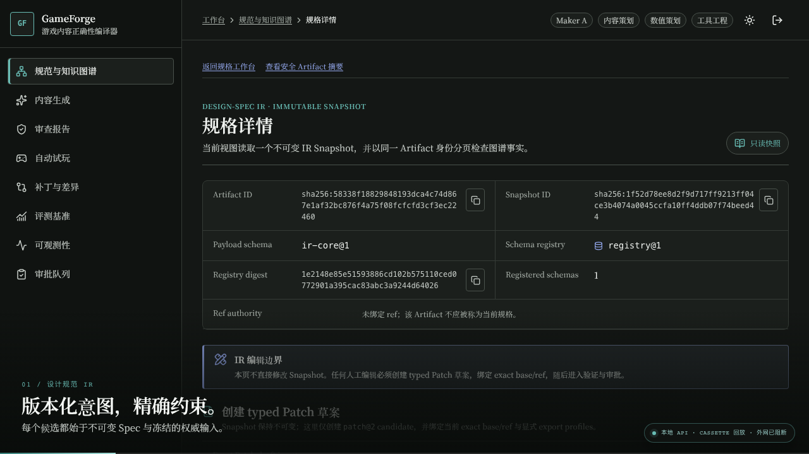</a></td>
    <td width="50%"><a href="docs/assets/readme/02-knowledge-graph.png">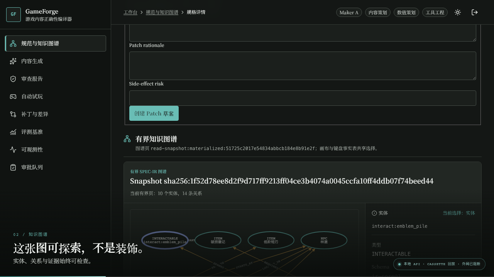</a></td>
  </tr>
  <tr><td><strong>Spec authority</strong></td><td><strong>Knowledge Graph</strong></td></tr>
  <tr>
    <td><a href="docs/assets/readme/10-eval-bench.png">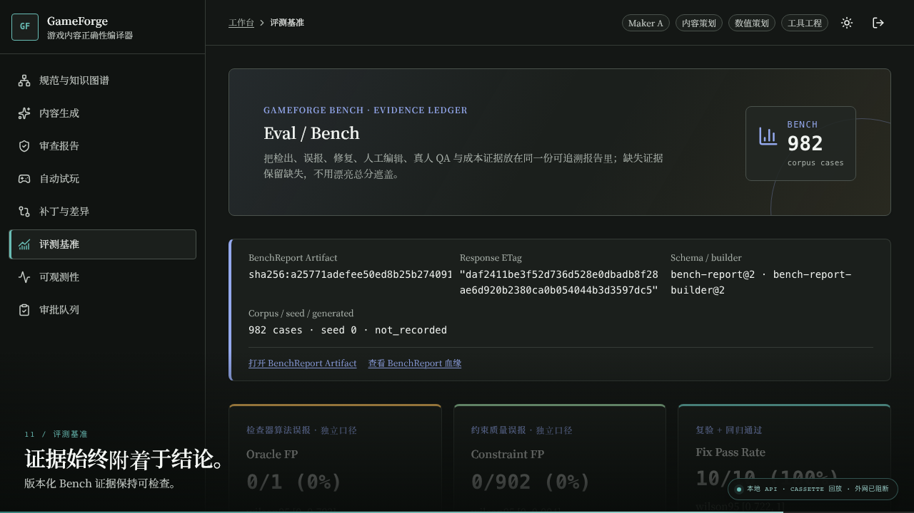</a></td>
    <td><a href="docs/assets/readme/11-observability.png">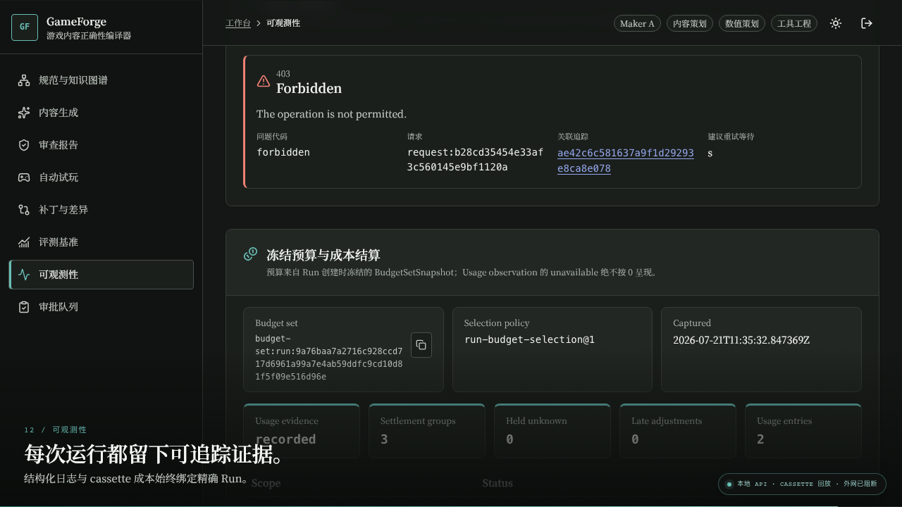</a></td>
  </tr>
  <tr><td><strong>Eval / Bench</strong></td><td><strong>Observability</strong></td></tr>
</table>

</details>

## 可复现证据

| 验证范围 | 冻结结果 | 结论边界 |
|---|---:|---|
| GameForge-Bench | **982** 个 seeded 样本 | 902 个 checker / simulation + 80 个 bounded narrative；`seed=0` |
| 确定性 / 仿真缺陷 | **11 类 × 82/82** 检出 | 每类 Wilson 95% 下界约 **95.5%**，不是“所有缺陷 100%” |
| Deterministic constraint-FP | **0/902** | 与 LLM-assisted narrative FP `6/381` 分开报告 |
| Agent 修复 | **10/10** | first-pass、runtime-vetted、cassette REPLAY；Wilson 95% CI **[72.2%, 100%]** |
| Playtest completion | flat `5/20` → layered `14/20` → memory `15/20` | 冻结 20 条 / 组；Planner / Executor **+45pp**，MemTrace 再 **+5pp** |
| 真人 QA 病例研究 | manual `0/4`；assisted `3/4` | 单一参与者、8 sessions / 4 matched pairs，不能泛化到所有用户 |
| QA 配对节省时间 | 平均 **3.41 min** | 95% bootstrap CI **[1.21, 5.04]**；错误 / 超时按预注册 8 分钟 cap |
| 产品 API | **90 paths / 98 operations** | 以当前 [`OpenAPI v1`](docs/api/openapi-v1.json) 为准 |

完整分母、置信区间和 evidence refs 保存在版本化的 [`BenchReport`](scenarios/bench/bench-report.json)，不是 README 手写成绩。

### 三种游戏内容证据不能混为一谈

<p align="center">
  <a href="docs/assets/readme/evidence-surfaces.svg">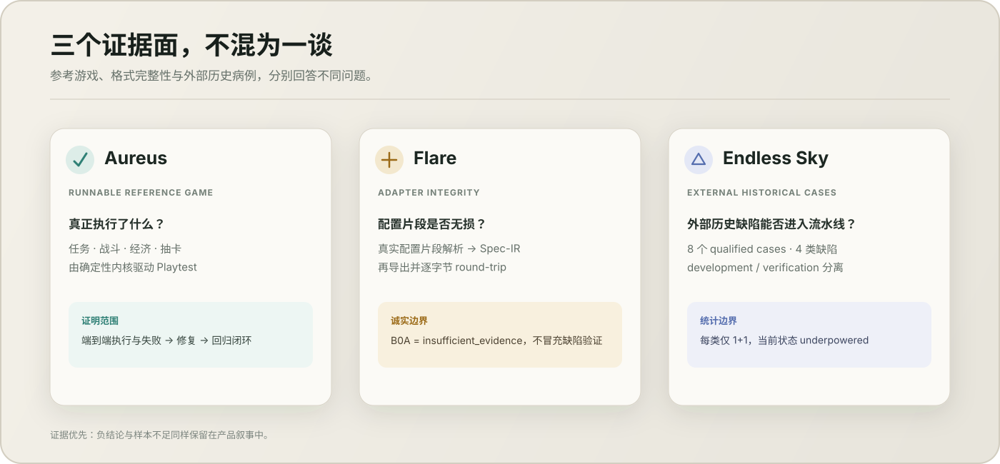</a>
</p>

- **Aureus** 是可运行参考游戏，证明任务、战斗、经济与抽卡可以进入真实 Agent-Env 闭环。
- **Flare** 证明精选真实配置可以无损往返；缺陷挖掘终态是 `insufficient_evidence`，没有被包装成有效性胜利。
- **Endless Sky** 冻结 8 个外部历史病例；每类仅 `n=1+1`，统计状态仍是 `underpowered`。

## 在本地验证

核心要求 Python 3.12 与 [`uv`](https://docs.astral.sh/uv/)；Web 与浏览器回放要求 Node.js 24.18.0、npm 11.16.0。

```bash
uv python install 3.12
uv sync --frozen

# 真实配置 workbook → IR → Aureus；四个系统确定性完成
uv run python -m gameforge.apps.cli scenarios/outpost 0

# 干净基线经过 Graph / ASP / SMT / simulation review
uv run python -m gameforge.apps.cli review scenarios/defects/clean scenarios/constraints 0

# 验证冻结 BenchReport 的 acceptance 约束
uv run python -m gameforge.bench.acceptance \
  --report scenarios/bench/bench-report.json \
  --repo-root .
```

重放 README 当前展示的项目旅程：

```bash
cd web
npm ci
npm exec playwright install chromium
npm run test:e2e -- --headed --grep \
  "creates a game from Feishu material"
```

重新生成同一旅程的 Playwright WebM、封面和 9 张 README 截图：

```bash
GAMEFORGE_RECORD_DEMO=1 npm run test:e2e -- --grep \
  "creates a game from Feishu material"
```

原始输出位于 `web/test-results/demo-project-workflow/`。仓库内 MP4 是同一 WebM 经 Chromium H.264 MediaRecorder 转封装后的无音轨版本；媒体来源、尺寸、时长与哈希见 [`docs/assets/readme/README.md`](docs/assets/readme/README.md)。

## 来源与许可

- README 主流程截图与视频来自同一次隔离 Playwright 流程；画面中的时间、身份和内容都是本地示例，不代表在线生产数据。
- 仓库只收录 Flare 的精选真实配置片段，不包含上游 engine code；CC BY-SA 3.0 来源与归属见 [`scenarios/flare_sample/NOTICE`](scenarios/flare_sample/NOTICE)，上游 engine code 本身为 GPL-3.0。
- Endless Sky 外部病例遵循 `GPL-3.0-or-later`；归属见 [`NOTICE`](scenarios/external_corpus/endless_sky/NOTICE)，冻结来源与 pin 见 [`source-profile.json`](scenarios/external_corpus/endless_sky/source-profile.json)。
- 仓库根目录尚未发布 LICENSE，请勿据此推定开源授权。

<p align="center"><sub>Correctness before confidence · Evidence before claims · Policy before release</sub></p>
